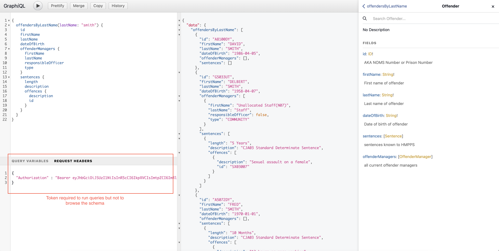
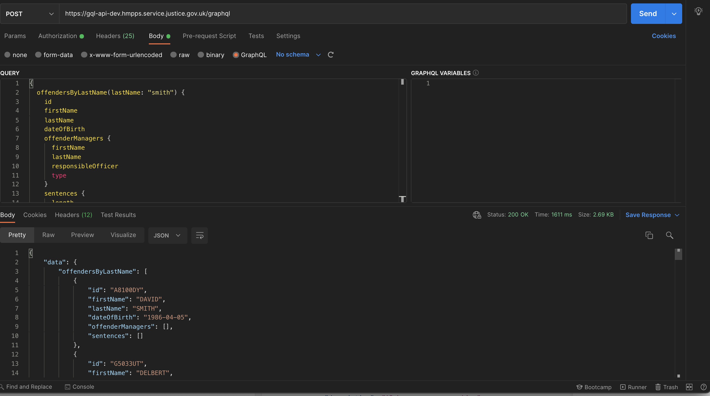

# GraphQL API Proof of concept

This project provides a proof of concept around using GraphQL in spring boot as described in 
[DT-2876](https://dsdmoj.atlassian.net/browse/DT-2876)

## PROBLEM:

- Clients consuming HMPPS data don't know what service to call to get the right data
- Documentation of those APIs are spread over many different services
- This will get worse as services move data out of NOMIS and Delius
- When services move data out of legacy, clients currently consuming data from legacy will need changing to consume from the new service
- Our ubiquitous language is less than ideal and is confusing with same the things called different things in different services, this creates confusion

## Potential solution:

- Front the legacy (prison-api, community-api) and new services with an edge server that delegates to the other services. GraphQL seems to fit our needs, since it can:
- Define a HMPPS schema with a consistent ubiquitous language
- Hide the underlining service delivering the data
- Can be performant since the client can define what data they want so additional calls to backend  services can be minimised
- Allow data to be migrated to new services with a only change to the GraphQL service not the consuming services

### The proof of concept will:

- A time boxed PoC (2 weeks/ 2 people) could prove:
- The technology is mature enough to use in the very near future
- We can model existing services using a difference ubiquitous language
- We can talk to more than one backend service
- We can talk to more than one endpoint for a given backend service and can be made performant
- The service can be secured using HMPPS Auth
- A possible working example is the DPS Offender Profile and the backend calls it currently makes

## Proof of Concept results

### Implementation

- The server was implemented using Spring Boot and Spring GraphQL in ths project. This is viewable using the [GraphQL playground](https://gql-api-dev.hmpps.service.justice.gov.uk/graphiql?path=/graphql)
- Additionally, a single nodejs service was amended to call this API this is accessible [here](https://hmpps-audit-poc-ui-dev.hmpps.service.justice.gov.uk) it requires any valid HMPPS Auth login. The code is available on [GitHub](https://github.com/ministryofjustice/hmpps-audit-poc-ui/blob/main/server/services/graphQLDemoService.ts)
- No other GraphQL frameworks were considered since Spring Boot was considered a technology that is well established in HMPPS and would support concepts and techniques understandable by existing development teams. It was also known that out of box security would work.
- Data was not accessed directly by this service but was delegated to existing APIs (prison-api and community-api) which themselves expose Rest endpoints.
- Data was mapped from the Rest services "schema" to the new GraphQL schema proving that we can create a simpler domain language that isn't tied to the legacy systems.
- All queries where asynchronous with queries returning a Flux (or Mono) of results. This meant any additional queries could run asynchronously while fetching parts of the tree. Though this meant the total time for a query is reduced, care must be taken to ensure the thread pool does not swamp downstream services affecting other clients of those services. 

### Maturity

- GraphQL as a technology is mature enough to use now since it has become an industry standard alongside Rest
- The Spring implementation is *close* to gold and at the point of the POC implementation it was at version 1.0.0-M4. The expectation is by the time this POC is turned into production code the Spring implementation would be gold.
- Since GraphQL can use HTTP, any client libraries will be mature enough since no specific library is required.

### Security
- The main /graphql endpoint and the playground `/graphiql` endpoint need to remain accessible without a role for introspection queries. This allows developers to browse the schema and view documentation. Ingress was adjusted to only allow access from known IP addresses that includes the MoJ VPN. It would be possible to change the configuration so only a development environment is open for extra peace of mind (though even in dev no data can be accessed without a valid token) since the schema/documentation would be the same in all environments.
- The data fetchers (Spring query controllers) is secured with a HMPPS token and also an additional role. This means clients could be opted in to use the service one by one.
- The clients token is passed through to the backend service (e.g, prison-api) for further validation. This means the security is essentially delegated to the backend service. Existing measures such as caseloads, probation area will work assuming the client passes in the end user's username. It maybe be possible to secure the data in other ways at the API level but given we have existing security rules already implemented that might be considered unnecessary.
- One impact of passing the token to downstream services is the client will need to have a single client credential that has all the required scopes and roles to access all the systems that hold the data it requires. This maybe a change for some clients that might have say one set of credentials to access prison-api and another for community-api. For these clients they would have to be collapsed into a single set.

### Performance
- Due to the asynchronous nature of the queries, the end to end time for queries is a good as the backend services can currently handle.
- n + 1 might be an issue without further investigation depending on how deep a query goes into the data graph ( the new @BatchMapping annotation has just been released to the GraphQL library). Currently, our services use JPA which supports batching of queries which mitigate against n + 1 queries however for GraphQL these backend services would naturally be slimmer and only return a portion of a graph. For instance, we would expect a smaller API to just return core Offender details, and another to say return the offender addresses, and another still return sentences etc. This means we loose control of the JPA optimisation. We did demonstrate a technique where a query can over fetch data and cache that data between queries. *See how Offences are returned as part of Sentencing*. This technique makes a judgement call that retrieving too much data would be overall more performant then making multiple separate calls. It is worth saying however, even with current Rest microservices n + 1 exists, but typically it is the client making the n + 1 calls, with GraphQL that decision-making is at least moved to one place.  

### Usability
- The GraphQL playground is a good place to test queries and see how they are executed. This also allows the viewing of documentation and see how the schema is defined. With the additional ability to execute queries. Running queries still require a valid HMPPS token with the appropriate roles even in the playground.

User interface from browsing the schema and executing queries  

From above left-hand panel ad-hoc queries can be constructed and executed. Code completion is available.
The right-hand side shows the schema browser with documentation, which is conceptually similar to swagger.
The middle panel shows the results of a query (in this case fake test data)
The bottom left shows that even for a development environment a valid token is required to execute queries and that token must have permission to access any downstream service. The token could be retrieved with cUrl or Postman using the appropriate client credentials.

- Queries could also be executed by Postman (or any tool that allows for HTTP requests)

Showing native support for GraphQL and integration with OAuth2 to retrieve a valid token.
- Called from nodejs

      const { prisonerNumber } = request
      const query = `query($prisonerNumber: String!) {
        offenderById(id: $prisonerNumber)  {
          id
          firstName
          lastName
          dateOfBirth
          offenderManagers {
            firstName
            lastName
            responsibleOfficer
            type
          }
          sentences {
            id
            description
            length
            startDate
            offences {
              id
              description
            }
          }
        }
      }`

      const response = await GraphQLDemoService.restClient(token).post<PrisonerQuery>({
        path: `/graphql`,
        headers: { 'Content-Type': 'application/json' },
        data: JSON.stringify({
          query,
          variables: {
            prisonerNumber,
          },
        }),
      })

      logger.info(`GraphQL response for single offender: ${JSON.stringify(response, null, 3)}`)
      return [response.data.offenderById]

- No special library is required to access the API, and Auth tokens are passed in the normal way. There maybe benefit from looking at libraries that make building the query simpler and for importing the schema to create TypeScript types to make development even easier.

### Logging 

- Logging and tracing work as expected. Application Insights still uses a shared operation id to correlate requests despite requests happening asynchronously. 

### Out of scope of POC
- the POC only looked at queries. GraphQL supports updates (mutations) and events (subscriptions). It is likely the any initial GraphQL API offering will just implement queries given HMPPS domain events are using AWS SNS which it is a well established technique. Updates tend to be done by specific specialised APIs and are surprising rare given the dominance of the legacy systems.

### Conclusion

- The proof of concept passed all the criteria we set ourselves, though a small amount of work is needed to investigate the Spring solution to the n + 1 problem
- The technology seems easy to pick up for established Spring developers and integration with frontend is no more complicated than the existing Rest services
- Using the delegated authentication approach means the data will be at least as secure it is now
- We have demonstrated that we can retrieve data from both Delius and NOMIS and map that to a shared domain language which mitigates against and issue we have with people struggling to understand the legacy language that differ between those two systems
- We have shown the API can perform as quickly as the slowest service since it can asynchronously retrieve data for parts of the data graph. Though lower branches of the graph may be dependent on the parent branches which undermines this somewhat 
- GraphQL seems a perfect fit for HMPPS Digital, and we would recommend moving forward from a POC to a pilot project  

### Next Steps
- Pilot the API against a service that would easily benefit from the GraphQL paradigm. For instance the DPS Quick Look page makes multiple calls to prison-api to construct a complex view. This might be an ideal use case to switch to a single GraphQL query.
- Investigate whether GraphQL should be used beyond this initial "gateway" type API. For instance would a new service use GraphQL by default and how would it integrate with the new API? How could a branch of a data graph be proxied to a new microservice.
- Investigate best practice for both clients using nodejs or JVM languages for integrating with the API. Though existing JavaScript clients work out of the box, and the Spring WebClient also work are there better choices?

### Further information

- Guidance on the use of GraphQL in government services can be found on [www.gov.uk](https://www.gov.uk/guidance/using-graphql-for-your-api)
